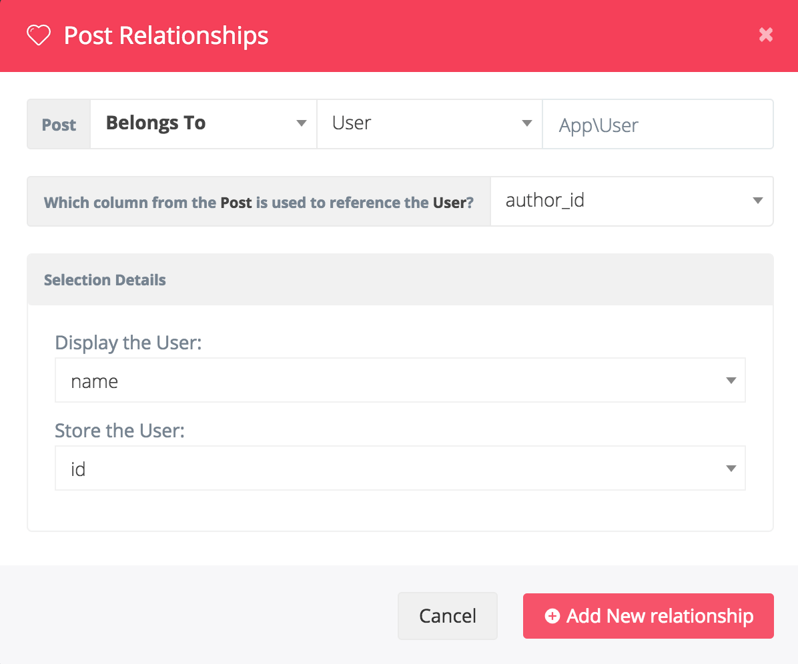

# Relationships

## Adding a relationship

Using the BREAD builder you can easily create Relationships between tables. At the bottom of the page you will see a new button that says 'Create Relationship'



**Notice**  
If you have not yet created the BREAD for the table yet, it will need to be created first and then you can come back after creating the BREAD to add the relationship. Otherwise you'll end up with a notification which looks like the following.



So, after the BREAD has already been created you will then be able to create a new relationship. After you click on the 'Create a Relationship' button. You will see a new Modal window that looks like the following:



You will first specify which type of relationship this is going to be, then you will select the table you are referencing and which Namespace that belongs to that table. You will then select which row combines those tables.

You can also specify which columns you would like to see in the dropdown or the multi-select.

Now, you can easily create `belongsTo`, `belongsToMany`, `hasOne`, and `hasMany` relationships directly in Voyager.

## Advanced options

If you need to set advanced options for `belongsToMany` relationship you can set, after saving relationship, these parameters in details field:

```php
{
    "foreign_pivot_key": "user_id",
    "related_pivot_key": "role_id",
    "parent_key": "id"
}
```

## Sorting relationships

You can sort the results of a relationship by setting the `sort` object in the relationship options:

```php
{
    "sort": {
        "field": "my_field",
        "direction": "asc"
    }
}
```

Or

```php
{
    "sort": {
        "field": "my_field",
        "direction": "desc"
    }
}
```
To sort by `my_field` descending.


## Scoping relationships

You can easily filter the shown relationship options by defining a [local scope](https://laravel.com/docs/eloquent#local-scopes) in the foreign model.  
For example, if you want to only show active entries, create a scope like:

```php
public function scopeActive($query)
{
    return $query->where('active', 1);
}
```

And add the following to the relationship options:

```php
{
    "scope": "active",
}
```

The value is the name of your scope-method without the word `scope`.  
The value for `scopeActive()` is `active`. For `scopeSomeUsers()` it is `someUsers`.
