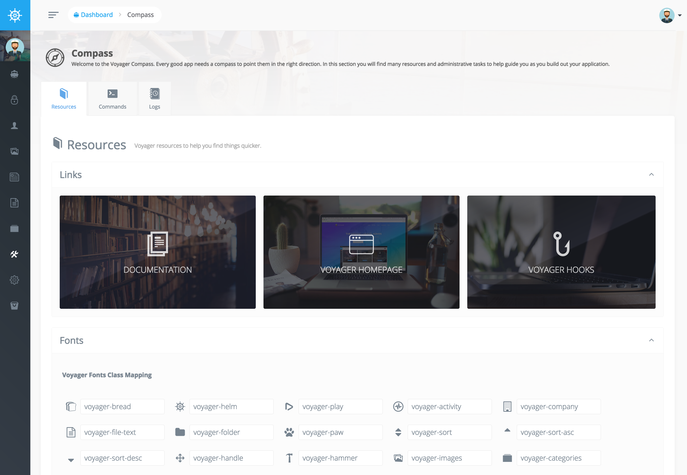
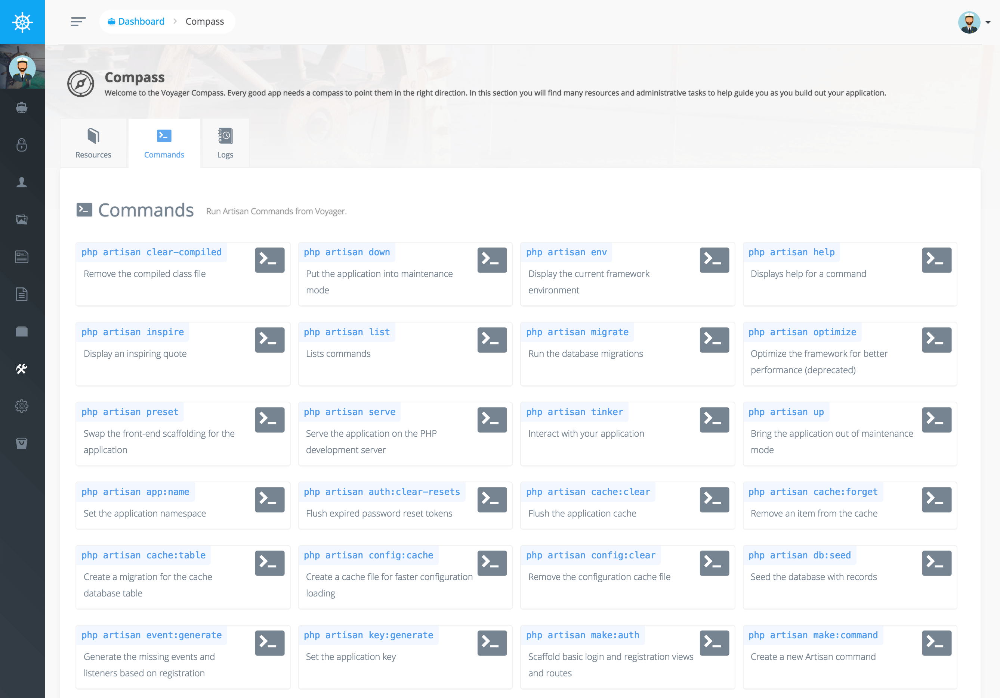
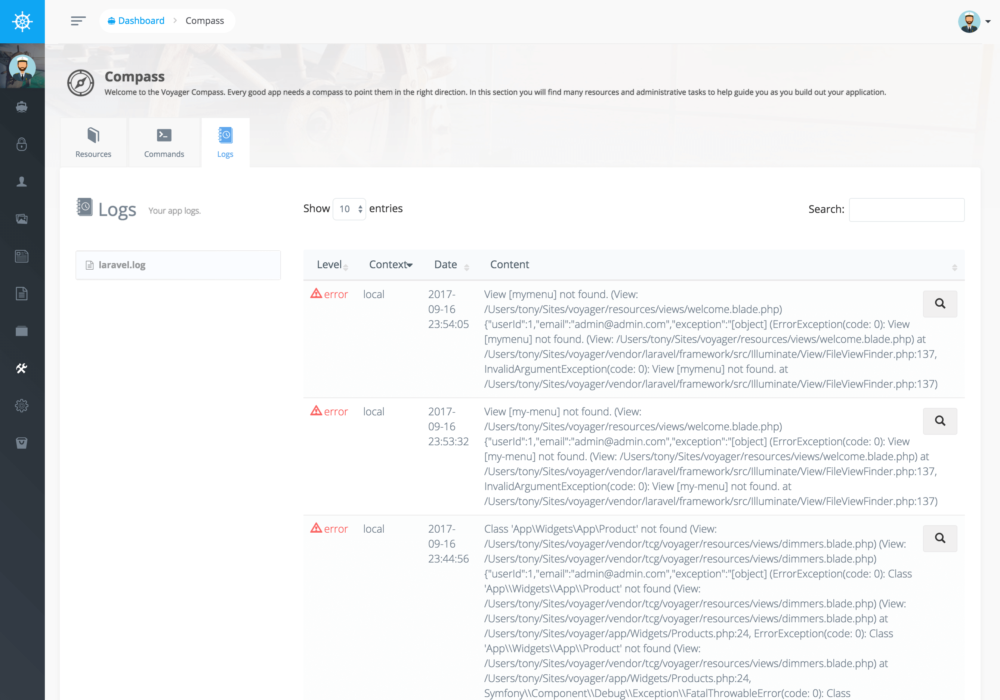

# Compass

The Compass section is a quick place for you to go for some link references, font references, run some commands or view some logs.

In the first tab you will see a few link resources and you will see all the fonts that you can use inside of Voyager.

In the Command section you can actually run some artisan commands directly from Voyager.

And Lastly, under the Logs tab you will be able to view all your application logs.

