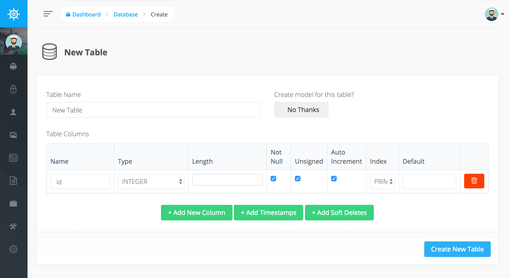

# Database Manager

> Warning: As of Laravel 11 the Doctrine DBAL package has been removed from Laravel. This currently breaks the Voyager Database Manager. We are working on a fix for this, but in the meantime, you can just use the Laravel Database migrations to manage your database instead.

Voyager has some awesome database tools which allow you to Add/Edit/Delete or view current database tables. The other cool part of Voyager is that you can add BREAD or \(Browse, Read, Edit, Add, & Delete\) functionality to any of your tables.

Inside of your admin panel you can visit Tools-&gt;Database and you'll be able to view all your current tables in your database. You may also click on 'Create a New Table' to create a new table in your database. All newly created tables will use the charset defined in your [default database connection](https://laravel.com/docs/database#configuration).

If you click the table name you can view the current schema. Additionally you can click on the View, Edit, or Delete buttons to perform that action for that table.

You may also choose to Add BREAD \(Browse, Read, Edit, Add, & Delete\) for any of your database tables. Once a table already has BREAD you may choose to edit the current BREAD or Delete the BREAD for that table.

Read on further about the BREAD builder in the next section.
