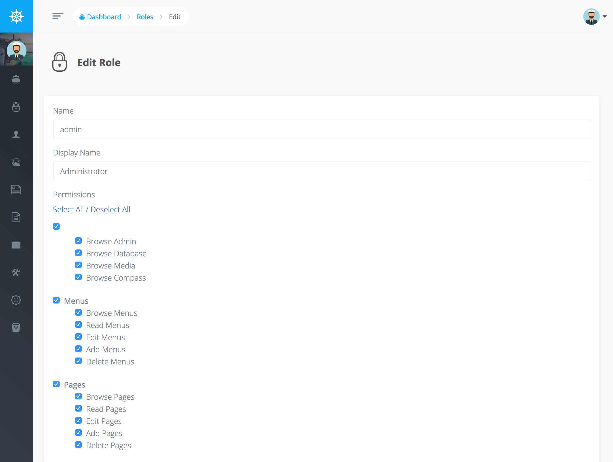

# Roles and Permissions

Voyager comes with Roles and Permissions out of the box. Each _User_ has a _Role_ which has a set of _Permissions_.

Inside of the dashboard you can choose to Add, Edit, or delete the current Roles. Additionally when you click to edit a particular role you can specify the BREAD permissions.



New in version 1.0, we've changed Voyager's authorization system to be [more in line with Laravel](https://laravel.com/docs/authorization#authorizing-actions-using-policies)! This means that you can check for permissions in the following ways:

```php
// via user object
$canViewPost = $user->can('read', $post);
$canViewPost = Auth::user()->can('read', $post);

// via controller
$canViewPost = $this->authorize('read', $post);
```

Out of the box there are some permissions you can use by default:

* `browse_admin`: Whether or not the user may browse the Voyager admin panel.
* `browse_database`: Whether or not the user may browse the Voyager database menu section.
* `browse_bread`: Whether or not the user may browse the Voyager BREAD menu section.
* `browse_media`: Whether or not the user may browse the Voyager media section.
* `browse_menu`: Whether or not the user may browse the Voyager menu section.
* `browse_settings`: Whether or not the user may browse the Voyager settings section.
* `read_settings`: Whether or not the user can view or see a particular setting.
* `edit_settings`: Whether or not the user can edit a particular setting.
* `add_settings`: Whether or not the user can add a new setting.
* `delete_settings`: Whether or not the user can delete a particular setting.

Additionally you can `Generate permissions` for every BREAD type you create. This will create the `browse`, `read`, `edit`, `add` and `delete` permission.

As an example, perhaps we are creating a new BREAD type from a `products` table. If we choose to `Generate permissions` for our `products` table. Our permission keys will be `browse_products`, `read_products`, `edit_products`, `add_products` and `delete_products`.


**Notice**  
If a menu item is associated with any kind of BREAD, then it will check for the `browse` permission, for example for the `Posts` BREAD menu item, it will check for the `browse_posts` permission. If the user does not have the required permission, that menu item will be hidden.


## Creating permissions for custom page

If you create a custom page and you want only allow specific user roles to access it, you may use permissions.

This only works if your slug comes directly after `/admin/`. So for a custom page of the form `/admin/sub/foo` the menu item will not be hidden from  the menu.

### Create permission
First, create a permission in the permissions table (you could use BREAD for example, model name is `TCG\Voyager\Models\Permission`). The column `table_name` should be set to null. The column `key` should be of the form `browse_slug` where `slug` has to be replaced with  the actual slug of your custom page. For example, to restrict access to your custom page with url `/admin/create_bill` you may create the permission `browse_create_bill`.

### Set role
Check the permission for each role that you wish to grant access to the site at `admin/roles`. In the above example you would find a new checkbox called "Browse Create Bill". If a user does not have the required permission, the menu item leading to your custom page will be hidden.

### Customize controller
You may create your own [gate](https://laravel.com/docs/authorization#gates) 

```php
Gate::define(`browse_create_bill`, function ($user) {
    return $user->hasPermission(`browse_create_bill`);
});
```
    
to use `authorize` in your controller:

```php
public function index()
{
  $this->authorize('browse_create_bill');
  //..
```

If you do so, make sure add the custom guard to your controller:

```php
  /**
   * Get the guard to be used during authentication.
   *
   * @return \Illuminate\Contracts\Auth\StatefulGuard
   */
  protected function guard()
  {
      return Auth::guard(app('VoyagerGuard'));
  }
```


## Using Permissions in your Blade Template files

You can also check for permissions using blade syntax. Let's say for instance that you want to check if a user can `browse_posts`, simple enough we can use the following syntax:

```php
@can('browse', $post)
    I can browse posts
@endcan
```

Or perhaps you need to run an else condition for a permission. That's simple enough:

```php
@can('browse', $post)
    I can browse posts
@else
    I cannot browse posts
@endcan
```

Couldn't be easier, right ;\)

