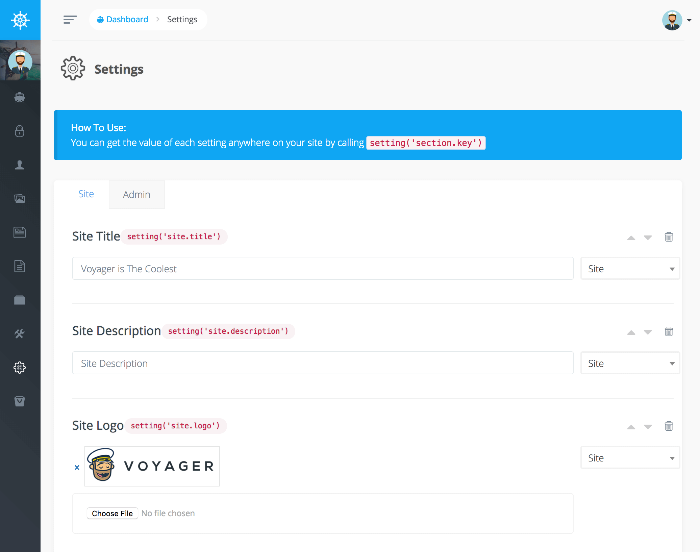

# Settings

The Settings section allows you to add any site wide settings you would like. You can add an image upload setting for your site logo or a text box for the main headline on your homepage.



In this new version you have the ability to add different groups for different settings. So, if you created a new setting inside of the `site` group and it had a key of `title` you would then be able to reference that setting any where on your site by doing the following:

```php
<?php
echo setting('site.title');
```

Or inside of any blade template like:

```text
{{ setting('site.title') }}
```

So, now you can add all kinds of settings in Voyager and reference them in your application.
