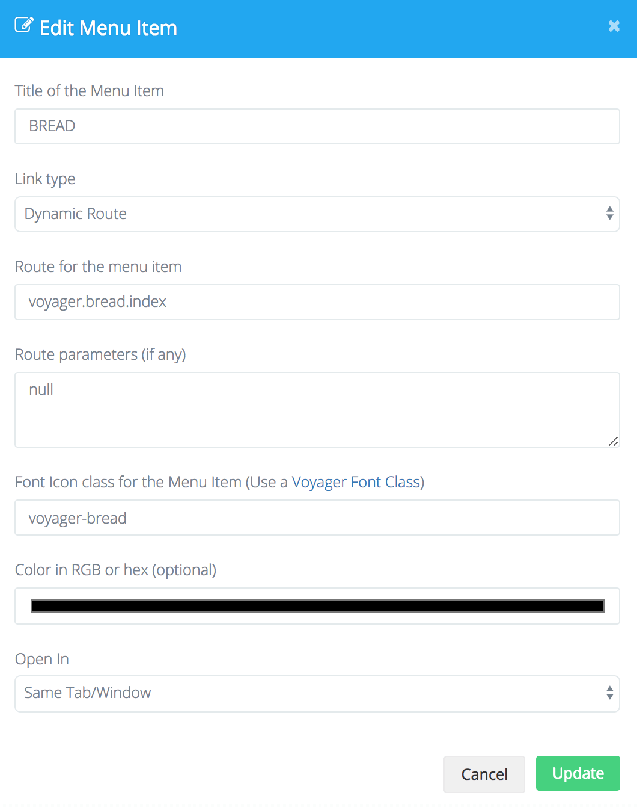

# Upgrading

## Upgrading 1.0 to 1.1

### Update your Composer.json

To update to the latest version inside of your composer.json file make sure to update the version of voyager inside the require declaration inside of your composer.json to:

`"tcg/voyager": "1.1.*"`

And then run `composer update`

### Run the necessary migrations

You will now need to run the following migrations to include new tables or rows that have been added to the latest version. you can find each of these migrations below:

```text
https://github.com/the-control-group/voyager/blob/1.1/migrations/2017_11_26_013050_add_user_role_relationship.php
https://github.com/the-control-group/voyager/blob/1.1/migrations/2017_11_26_015000_create_user_roles_table.php
https://github.com/the-control-group/voyager/blob/1.1/migrations/2018_03_11_000000_add_user_settings.php
https://github.com/the-control-group/voyager/blob/1.1/migrations/2018_03_14_000000_add_details_to_data_types_table.php
https://github.com/the-control-group/voyager/blob/1.1/migrations/2018_03_16_000000_make_settings_value_nullable.php
```

You can do this by adding each of those migrations to your `database/migrations` folder and then run `php artisan migrate`

### Update Configuration

The `voyager.php` configuration file has had a few changes. The `prefix` key has been removed in favor of the `user.redirect` key. Please note that the `user.redirect` key should be prefixed with a slash \(`/`\), unlike the original `prefix` key.

### Multi Roles

Multi-roles is a new feature come by in v1.1 that allows you to have multiple roles and one primary role. You can fetch the user's primary role like normally using this:

```php
$user->role->name // Name of primary role
```

But now you can also use the new belongsToMany roles relationship to fetch all extra roles:

```php
$user->roles() // gets all extra roles relationship
$user->roles()->get() // gets all extra as a collection
```

Besides that there is a helper to get all the roles, both the primary and the extra roles:

```php
$user->roles_all() // collection of all roles
```

Please note, that you do not have to use the multi-roles and you can continue to use the primary role without any changes.

Also, make sure that you add the new data row into the database for the `users` data type. Insert a new row of data in the `data_rows` table. Make sure that it's `data_type_id` is the ID for the `users` data type, normally this would be ID `3`, but better make sure it is correct.

Then make sure the other fields are like below:

| field | user\_belongstomany\_role\_relationship |
| :--- | :--- |
| type | relationship |
| display\_name | Roles |
| required | 0 |
| browse | 1 |
| read | 1 |
| edit | 1 |
| add | 1 |
| delete | 0 |
| details | `{"model":"TCG\\Voyager\\Models\\Role","table":"roles","type":"belongsToMany","column":"id","key":"id","label":"name","pivot_table":"user_roles","pivot":"1"}` |
| order | 11 |

### Bread

The BREAD and Database section in Voyager has been separated into two sections. So in order to get access to the BREAD section using the menu, make sure to add the following menu item:



However, you might still not be able to see it, because it requires permission, so go ahead and create a new row in the `permissions` table with the `key` being `browse_bread`, leave the `table_name` to be `null`.

You should now be able to access the BREAD section.

## Translations

> If you have not translated any of the Voyager language strings, you may skip this step.

Voyager have changed its translations strings from being like `__('voyager.generic.close')` to be prefixed with the `voyager::` group.

Meaning that you would have to update your translated strings inside `resources/lang/LOCALE.json` to use the new prefix.

## Final Steps

Next, you may want to be sure that you have all the latest published assets. To re-publish the voyager assets you can run the following command:

```text
php artisan vendor:publish --tag=voyager_assets --force
```

Then you may wish to clear your view cache by running the following command:

```text
php artisan view:clear
```

## Troubleshooting

Be sure to ask us on our slack channel if you are experiencing any issues and we will try and assist. Thanks.

