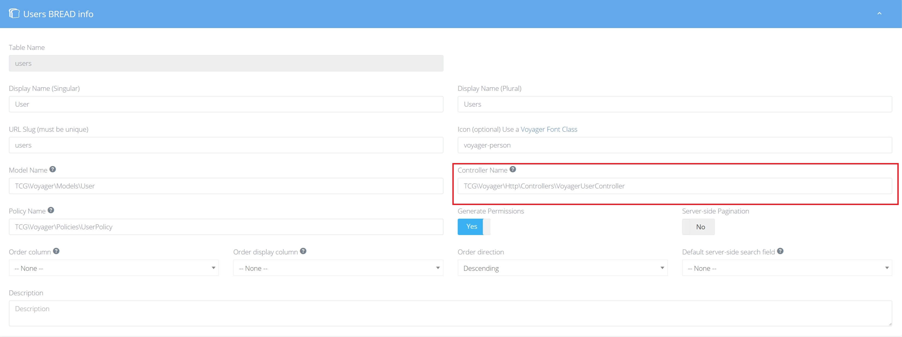

# Upgrading

## Upgrading 1.1 to 1.2

### Laravel and PHP versions

Support for Laravel 5.4 was dropped in Voyager 1.2 and therefore the minimum PHP version is now 7.1.  
Please update your versions accordingly!

### Update your Composer.json

To update to the latest version inside of your composer.json file make sure to update the version of Voyager inside the require declaration inside of your composer.json to:

`tcg/voyager": "1.2.*`

And then run composer update

### Update Configuration

The `voyager.php` configuration file has had a few changes.

```php
'storage' => [
    'disk' => 'public',
],
```

is now

```php
'storage' => [
    'disk' => env('FILESYSTEM_DRIVER', 'public'),
],
```

Also, the option

```php
'database' => [
    'autoload_migrations' => true,
]
```

was added. This allows you to exclude Voyagers migration-files from loading when running `php artisan migrate`.

The media-manager got some new configuration-options:

```php
'media' => [
    // The allowed mimetypes to be uploaded through the media-manager.
    'allowed_mimetypes' => '*', //All types can be uploaded

    /*'allowed_mimetypes' => [
        'image/jpeg',
        'image/png',
        'image/gif',
        'image/bmp',
        'video/mp4',
    ],*/

    //Path for media-manager. Relative to the filesystem.
    'path'                => '/',
    'show_folders'        => true,
    'allow_upload'        => true,
    'allow_move'          => true,
    'allow_delete'        => true,
    'allow_create_folder' => true,
    'allow_rename'        => true,
],
```

Compass is now switched off automatically when the environment is not `local`.  
This can be overridden by the following new config-key:
```php
'compass_in_production' => true,
```

The top dropdown-items can now be translated by providing a language-key:

```php
<?php

'navbar_items' => [
    'voyager::generic.profile' => [
        'route'      => 'voyager.profile',
        'classes'    => 'class-full-of-rum',
        'icon_class' => 'voyager-person',
    ],
    'voyager::generic.home' => [
        'route'        => '/',
        'icon_class'   => 'voyager-home',
        'target_blank' => true,
    ],
    'voyager::generic.logout' => [
        'route'      => 'voyager.logout',
        'icon_class' => 'voyager-power',
    ],
],
```

If you were using casts in your user-model previously, please remove the array-cast of `settings`.

### Deprecation

`can`, `canOrAbort`, `canOrFail` in the Voyager facade were all removed in favor of Policies and Gates.  
Please refer to the [Laravel documentation](https://laravel.com/docs/authorization).

### User BREAD

The User BREAD now has its own controller. Please update your User BREAD to use `TCG\Voyager\Http\Controllers\VoyagerUserController` as the controller: 

### Final Steps

Voyager changed its way on how to load assets.  
Assets don't get published anymore, instead they are loaded directly from the package.  
Because of that, you can safely remove everything from your `public/vendor/tcg/voyager` folder.  
Also you can remove the `assets_path` config-key from `config/voyager.php`.

## Troubleshooting

Be sure to ask us on our slack channel if you are experiencing any issues and we will try and assist. Thanks.
