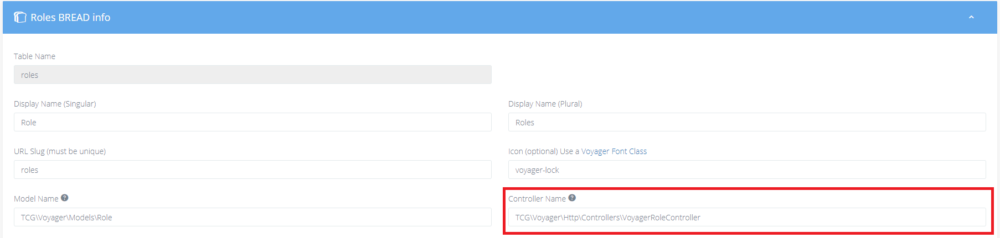

# Upgrading

## Upgrading 1.3 to 1.4


Please take a look at our [prerequisites](../getting-started/prerequisites.md) before upgrading!


### Update your Composer.json

To update to the latest version inside of your composer.json file make sure to update the version of Voyager inside the require declaration inside of your composer.json to:

`tcg/voyager": "1.4.*`

And then run `composer update`

### Updating the roles BREAD

The roles BREAD now uses it's own controller.  
Please update it to use `TCG\Voyager\Http\Controllers\VoyagerRoleController`

### TinyMCE initialization

Initialization has been moved from app.js to `rich_text_box` template, if you were using TinyMCE outside the standard template take a look at documentation [tinymce](../bread/formfields/tinymce.md)

### Troubleshooting

Be sure to ask us on our slack channel if you are experiencing any issues and we will try and assist. Thanks.
