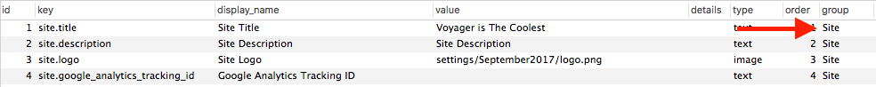

# Version 0.11 to 1.0

 **Update your Composer.json**

To update to the latest version inside of your composer.json file make sure to update the version of voyager inside the require declaration inside of your composer.json to:

```text
"tcg/voyager": "1.0.*"
```

And then run composer update

 **Run the necessary migrations** 

You will now need to run the following migrations to include new tables or rows that have been added to the latest version. you can find each of these migrations below:

* [https://github.com/the-control-group/voyager/blob/master/publishable/database/migrations/2017\_07\_05\_210000\_add\_policyname\_to\_data\_types\_table.php](https://github.com/the-control-group/voyager/blob/master/publishable/database/migrations/2017_07_05_210000_add_policyname_to_data_types_table.php)
* [https://github.com/the-control-group/voyager/blob/master/publishable/database/migrations/2017\_08\_05\_000000\_add\_group\_to\_settings\_table.php](https://github.com/the-control-group/voyager/blob/master/publishable/database/migrations/2017_08_05_000000_add_group_to_settings_table.php)
* [https://github.com/the-control-group/voyager/blob/master/publishable/database/migrations/2017\_04\_11\_000000\_alter\_post\_nullable\_fields\_table.php](https://github.com/the-control-group/voyager/blob/master/publishable/database/migrations/2017_04_11_000000_alter_post_nullable_fields_table.php)
* \(possibly need this migration, if already exists do not include\) [https://github.com/the-control-group/voyager/blob/v0.11.14/publishable/database/migrations/2017\_04\_21\_000000\_add\_order\_to\_data\_rows\_table.php](https://github.com/the-control-group/voyager/blob/v0.11.14/publishable/database/migrations/2017_04_21_000000_add_order_to_data_rows_table.php)

You can do this by adding each of those migrations to your `database/migrations` folder and then run `php artisan migrate`

**Upgrading Settings**

Only applicable if you are using settings in your application. New to version 1.0, settings are grouped by section. For instance the following setting will not work:

```php
{{ setting('title') }}
```

Each setting key will now belong to a group. Which means that you would need to change the setting to:

`{{ setting('site.title') }}`

And that title key would now need to have a group with the name of 'Site', like the following:



To update all the settings in your app, you may want to, just create a group name, such as Site, and then update all your settings to include the `site` prefix:

```php
{{ setting('site.description') }}
```

Any previous Admin settings have been added to a group called 'Admin'.

**Final Steps** 

Next, you may want to be sure that you have all the latest published assets. To re-publish the voyager assets you can run the following command:

```text
php artisan vendor:publish --tag=voyager_assets --force
```

Then you may wish to clear your view cache by running the following command:

```text
php artisan view:clear
```

At last, must change your `User` model to extend `TCG\Voyager\Models\User`

```php
use TCG\Voyager\Models\User as VoyagerUser;

class User extends VoyagerUser
{
    // ...
}
```

And now you'll be upgraded to the latest version.

 **If you're planning to use hooks**  If you want to use Hooks \(Voyager's built-in plugin system\) you must run `php artisan hook:setup` before it will work. This is now included in `php artisan voyager:install`, so this will only need to be run after upgrading from an earlier version.

 **Troubleshooting** 

Be sure to ask us on our slack channel if you are experiencing any issues and we will try and assist. Thanks.

